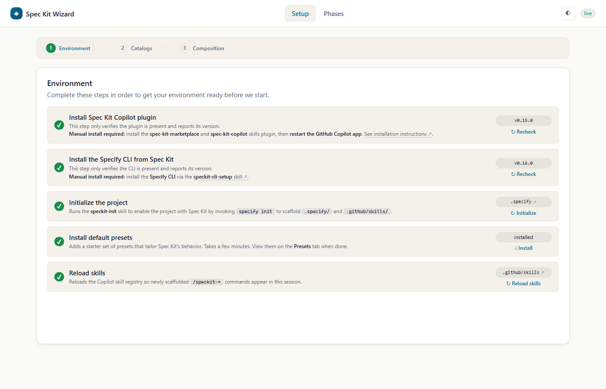
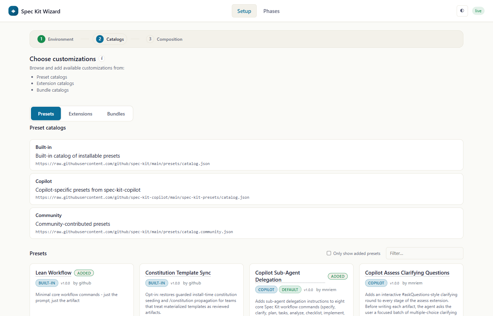
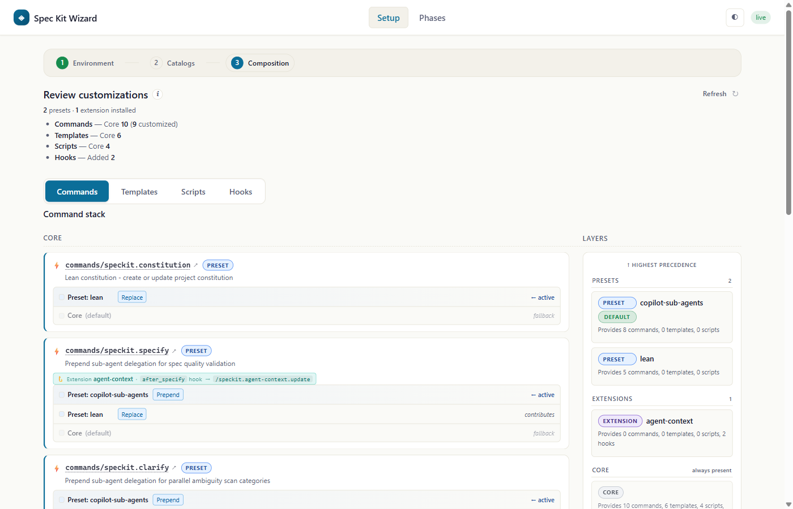
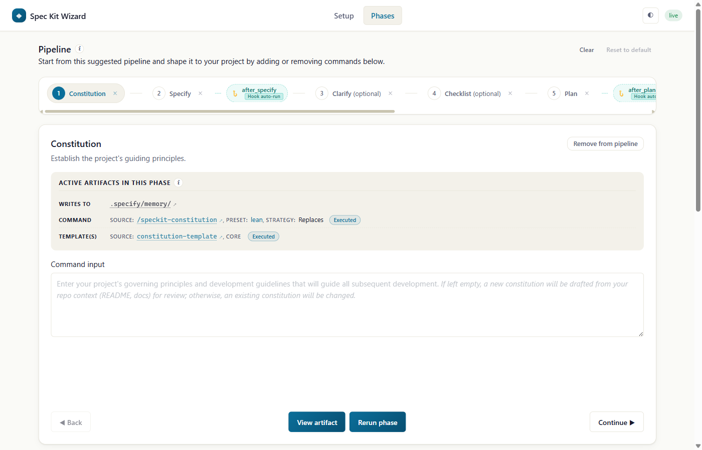

# speckit-wizard

A **visual, guided wizard** that brings Spec-Driven Development into an
interactive canvas — a showcase of both the [Spec Kit `specify`
CLI](https://github.com/github/spec-kit) and the
[`spec-kit-copilot`](https://github.com/github/spec-kit-copilot) plugin.
Ships as a GitHub Copilot **canvas extension** that sits on top of the
plugin's `speckit-*` skills (which in turn shell out to the `specify`
CLI) and gives you three complementary ways to work with them:

1. **Discover.** Browse the full catalog of presets, extensions,
   and bundles that customize the SDD lifecycle — with
   descriptions, source, and one-click activation, all in one place.
2. **Visualize the composition.** See how the presets and extensions
   you've layered on top of core combine — which layer contributes which
   artifact, where the hooks come from, and the resulting pipeline your
   project will actually run:

   ```
   setup → constitution → specify → clarify → plan → tasks → analyze → checklist → implement
   ```
3. **Execute the lifecycle.** Drive every phase from the **Phases** tab —
   click a phase in the pipeline, fill its form, watch the agent produce
   the artifact via the matching `speckit-*` skill.
4. **Generate a dedicated canvas.** Turn the current, user-shaped phase
   pipeline into a project canvas extension under `.github/extensions/`.
   The wizard compiles the selected commands into a validated blueprint,
   then asks Copilot's `/create-canvas` skill to scaffold, author, reload,
   and verify the generated canvas.

Everything under the hood routes through the `spec-kit-copilot` plugin's
skills, so the same guardrails and behaviors apply whether you drive
Spec Kit from the wizard, from chat, or from the `specify` CLI.

### The four main pages

**Setup → Environment** — verifies prerequisites (plugin, CLI, project init,
default presets, skills reload) and lights up each step as it completes.



**Setup → Catalogs** — browse Built-in, Copilot, and Community catalogs of
presets, extensions, and bundles, and add the ones you want to your project.



**Setup → Composition** — the layered view of what your project actually runs:
per-artifact stacks (commands, templates, scripts, hooks) resolved across
Core, presets, and extensions, plus a Layers sidebar in precedence order.



**Phases** — the executable pipeline. Click any phase to see its active
artifacts, provide input, and run the matching `speckit-*` skill. Use
**Generate canvas** to create a dedicated, Wizard-styled canvas from the
current phase sequence.



## Quickstart

> This is a **canvas extension** — it opens in the **GitHub Copilot app**
> side panel, not the terminal CLI. There is no slash command or menu
> entry.

1. Register the marketplace and install it (see [Install](#install)):

```bash
  copilot plugin marketplace add OWNER/spec-kit-copilot
   copilot plugin install spec-kit-copilot-wizard@spec-kit-marketplace
```
2. Ask Copilot in chat: **"Open the Spec Kit Wizard"**.

The agent opens the wizard in a side panel. See
[Opening the dashboard](#opening-the-dashboard) for details.

## What it does

- **Guided setup** — the **Setup** tab walks you step-by-step through
  getting your environment ready to run Spec Kit. The wizard checks
  each step and tells you what to do next.
- **Catalogs** — browse built-in, Copilot, and community catalogs for
  presets, extensions, and bundles. Install them to customize your SDD
  lifecycle.
- **Composition** — see which presets and extensions are layered on top
  of core, and their composed artifacts.
- **Phases pipeline** — the **Phases** tab shows a live pipeline of every
  phase in your lifecycle. Each phase corresponds to a command you
  execute — customize the commands in the pipeline, provide input to
  execute them, and view each artifact produced.
- **Canvas generation** — generate a project-scoped canvas extension from
  the exact effective pipeline shown on the Phases page. The dialog lets
  you edit the extension id, display name, and description, previews the
  output path, and warns before replacing an existing target.

## Generating a canvas from a pipeline

Complete Setup, install the presets/extensions you want, and shape the
pipeline on the **Phases** page. Click **Generate canvas**, review the
ordered commands and inferred artifact targets, then choose the generated
extension id and canvas name.

The wizard stores a deterministic generation request and a versioned
canvas-template snapshot under `.speckit-wizard/generated-canvases/`.
The agent invokes `/create-canvas`, scaffolds the extension, runs the
request-scoped materializer, reads the selected commands' skill files, and
uses a concise generation prompt focused on procedure and configuration authoring.
The request is authoritative; template-owned UI and runtime behavior are not
repeated as implementation instructions. Skill files are reference data, not
commands to execute during generation. The agent
customizes only the validated `workflow-config.json` (item labels, fixed phase
argument prefixes/suffixes, and concise per-phase input labels/helpers derived from
the effective installed skills, including preset overrides). Phase input guidance
appears inside the empty textarea as placeholder text that disappears when typing
and returns when cleared; it is never prefilled or submitted as input.
The field label remains visible, and a screen-reader description retains the guidance
without a visible helper paragraph. It describes content only,
without slug, workflow-ID, or location instructions; Workflow slug and Writes to
remain separate. Input is labelled optional only when supported by the skill,
otherwise neutral; empty input never blocks Run. `workflow-adapter.mjs` is protected template code,
not an executable customization point. The renderer, secure runtime, and
pipeline data are deterministic rather than LLM-authored. Before extension reload,
the request-local materializer's `--validate` mode verifies code hashes, metadata
substitutions, blueprint equality, and the configuration schema; the result callback
also validates the output. These are static integrity checks, not workflow tests.
Production generation does not run test suites or browser automation, probe actions,
install components, or execute/queue phases. After reporting success, the agent opens
the generated canvas once as the final user handoff and stops without interacting
with it. The canvas's normal automatic setup-on-open behavior is unchanged.
The provider is inspected only for load status after reload. The result is
written to:

```text
.github/extensions/<extension-id>/
```

Generation is intentionally **one-way**. The Wizard does not import edits
from generated files. If the target directory already exists, the Wizard
requires a second explicit confirmation before generating and replacing
it. After the initial generation, treat the output as repository-owned
code that your team maintains normally.

The Wizard Phases surface and generated canvases share the same canonical
workflow UI package. Generated canvases vendor that package, so they remain
self-contained while preserving the Wizard header, horizontal stepper,
phase-card language, artifact viewer, responsive layout, and light/dark
themes. Their pipeline is immutable: they do not expose Add, Remove, Clear,
Reset, reorder, or recursive Generate canvas controls.

The generated `pipeline.json` also carries a portable setup contract: the
presets/extensions installed in the Wizard workspace and full required skill
records derived dynamically from the selected phases. By default, when an incomplete
generated workflow first opens, that generated canvas—not the Wizard—sends a
setup prompt to the coding agent. The agent initializes Spec Kit and reconciles
the recorded contributions, then invokes the generated canvas's
`reloadSessionSkills` action, backed by `session.rpc.skills.reload()`. The
generated runtime verifies files and contribution state through read-only filesystem
checks and cached `specify preset list` / `specify extension list` queries, and does
not mark contribution-dependent workflows ready until that agent reconciliation
and session reload complete. Contribution readiness is verified from observed
installed/enabled state, exact priorities, and recorded relative precedence;
changes invalidate cached readiness. CLI queries are coalesced, expire after 30 seconds,
and are forcibly refreshed by `reloadSessionSkills`. By default, community acceptance
belongs to the admin's Wizard configuration step and setup remains automatic.
The optional **Require installation approval** setting adds the recipient gate
described below. Platform/tool permissions remain in effect, and unrelated
destination contributions are not removed.

Generated artifact reads are limited to declared artifact paths, reveal actions to
their containing directories, and deletion to an exact workflow item directory.
Traversal and symlink/junction paths are rejected. Named Markdown artifacts such as
SDD checklists use a deterministic newest-file selection within their declared folder.
Configuration validation rejects unsupported behavior instead of executing generated
JavaScript or silently substituting defaults. These rules ship in new template
snapshots (version 11); existing generated apps are not rewritten automatically.

Generated Markdown artifacts now expose the Wizard's **Clarify** / **Answered ✓**
controls for `[NEEDS CLARIFICATION: …]` markers outside code examples and links.
Answers are staged per workspace/canvas, workflow item (or project Constitution),
exact phase and artifact. Only **Apply and Rerun** plus confirmation dispatches the
captured phase through the normal approval/setup/Constitution gates. Viewing,
polling, answering and Back never dispatch. Back, cancellation, failed/gated sends
and setup-queued responses retain drafts; direct success clears only unchanged
submitted revisions, keeping concurrent edits. Browser-local draft persistence is
limited to the same loopback origin. The existing viewer and modal theme is retained.

Generation automatically supports multiple workflow instances when the pipeline
has a shared slug-scoped artifact root. The popup no longer offers an instance-mode
toggle; all such canvases include the workflow collection and New action.
Project-only pipelines retain a single project view because they have no separate
workflow folders. Existing single-instance generated canvases remain compatible.

The Generate popup shows Target first as a read-only textbox styled like the other
fields. Each textbox has its label and a concise description above the control.
Target is still derived from Extension ID, not editable or submitted independently.
The popup provides one **Canvas workflow header** field, described as
"Heading shown to users above the grouped workflows, such as Assessments or Bugs."
(default **Workflows**). The admin's single-line name (1-80 characters) is captured
in immutable `pipeline.json` metadata and used as the collection heading exactly,
without singular/plural conversion. Other copy stays neutral: **New**,
**Current selection**, **Search…**, and deletion by the selected item's actual name.
The New button is also available in empty collections. This presentation setting
does not change slugs, artifact locations, phase names, or commands.

The optional user-provided slug setting lets users specify the directory name for
generated workflow artifacts. When disabled, no slug field or `slug=` argument is
added: Spec Kit chooses a default, or Copilot may ask the user in the chat session.
This does not affect the project-scoped Constitution.

The toolbar shows generation activity on the Generate button itself, without
adjacent status, output-path, or error text. The generation prompt directs the agent
to explain failures in chat, including when the callback cannot be delivered.
Generation results remain recorded; field-validation feedback stays in the popup.

### Optional project Constitution

When the selected commands include canonical `speckit.constitution`, generation
retains its exact command, source/provider, stable instance key and required skill,
and adds the template-owned `projectArtifacts.constitution` reference. The complete
ordered `pipeline.steps` remains provenance; a shared command-view helper excludes
only that referenced record from the numbered workflow, per-item artifacts, item
root derivation and first slug-input placement. Select one Constitution command;
duplicates or outputs without a safe, fixed, persistent project Markdown path
fail generation explicitly. Effective preset overrides keep their captured path
and skill semantics rather than assuming `.specify/memory/constitution.md`.

Generated canvases display one compact **Constitution** card above the workflow
collection, with **View** and **Create / update**. There is no Constitution section
below the pipeline. Create / update opens **Run Constitution**, with **Guidance**,
an empty native placeholder, and **Cancel** / **Run**. The standard skill uses
“Optional: principles to emphasize (e.g. testing, performance, UX)”; effective
overrides supply their own content-only guidance. Configuration must still include
the Constitution's exact `phaseInputs` key. The dialog has no item picker or slug,
never pre-fills/submits its placeholder, and runs the captured skill in chat.
Viewing or updating keeps the selected workflow, phase and input draft.

Execution ordering is installation approval (when required), observed setup and
session skills, then verified Constitution, then normal phases. The server checks
the prerequisite on HTTP/action runs, reruns, and setup-queue draining. An unready
Constitution returns `constitution_required` without phase dispatch or requeueing;
the user can still browse, select phases, and draft inputs. Constitution itself
remains runnable after setup, without creating/binding an item or reserving a slug.
It never runs automatically or triggers downstream reruns.

Status comes from bounded (512 KiB), allowlisted, regular-file reads: missing/empty
is **Not created**, unresolved uppercase `[PLACEHOLDER]` tokens mean **Template**,
nonempty completed content is **Ready**, and unreadable/unsafe/oversized output is
an explicit blocking error. Ready is a completion heuristic, not policy-quality
validation, formal ratification, or human approval. Every panel observes the same
project artifact on refresh and through the existing one-second polling/SSE path;
neither dispatch acknowledgement nor elapsed time can establish readiness.
Removing the content or reintroducing placeholders blocks subsequent phase runs.

Constitution-only selections show the usable card without a dummy workflow or
empty stepper. If the descriptor is absent, no Constitution card, status read or
gate is added—even when the file exists. Older generated snapshots keep their
previous numbered-phase behavior until explicitly regenerated.

### Optional installation approval

**Require installation approval** defaults to off: the app automatically installs
missing included components without asking for its own installation approval.
Normal host/platform tool permission checks still apply; this UI consent setting
does not bypass them. When enabled, the generated
canvas first checks the current project's actual registry, manifests, and
read-only CLI inventory. If every required component is already installed,
including installations performed directly through the CLI, no installation
approval panel or consent record is needed. Configuration and session-skill
readiness remain separate; existing components are not reinstalled.
When one or more required components are missing, the canvas shows an inline
panel containing only its captured `setup.presets` and
`setup.extensions`, never unrelated catalog entries or destination-installed
components. Known community contributions need a recorded HTTPS installation
source before an approval-enabled request can be generated. Source references
are shown as recorded, not presented as a trust or safety endorsement.
The review section uses separated component rows with type badges and expandable
**View source** links. It does not display priority, precedence, enabled state,
or installed-state labels. Community badges
appear only for recorded community sources. Missing source information is
explicit; no example descriptions or source links are invented. Actions stack
at narrow widths, and the rest of the canvas retains its existing layout.

**Approve and install** approves the complete configuration. **Not now** installs
nothing and leaves a compact notice with **Review installation**. Before approval,
the runtime blocks automatic/manual setup, session-skill reload, and phase execution
while required components are missing;
it does not secretly queue an attempted phase. Existing read-only previews,
navigation, and input drafting remain available. Empty contribution lists do not
show a misleading approval panel.

Approval is remembered per canvas, workspace, and installation contract, separately
from actual readiness. A changed contract requires renewed approval only if
installation is needed. Already-installed components are retained. External
installations are detected on refresh without requiring the user to approve
again. Unreadable or ambiguous evidence reports a verification error, never an
assumption that installation is required. Setup errors remain
visible for retry, and partial installation failures are not rolled back as a
transaction. The installation section disappears when the required components
are verified as installed; phase execution still waits for setup and session-skill
readiness. It uses the existing theme; the rest of the generated canvas UI remains
unchanged. Missing/false settings retain the original automatic behavior.

The first version supports linear project workflows and linear workflows
with one primary item/slug type, text arguments, and Markdown artifacts.
Unsupported branching, parallel, multi-item, specialized-editor, or
non-text-artifact workflows fail preflight with an explicit visualization
error instead of receiving a misleading best-effort canvas. Transient or
optional phases remain supported and are represented without fabricated
artifact or progress state.

## Opening the dashboard

This is a **canvas extension**, so it renders in the **GitHub Copilot app**
side panel — not in the plain terminal CLI. Installing the plugin
only *registers* the canvas; nothing opens automatically.

To open it, ask Copilot in chat, e.g. **"Open the Spec Kit Wizard"** (or
"open the wizard"). The agent matches your request to this canvas
(`id: speckit-wizard`, displayName **"Spec Kit Wizard"**) and opens it
in a side panel. There is no slash command or menu entry — discovery is
the agent matching the canvas name/description.

Once it is open you can drive it two ways:

- **Click through the wizard UI** in the canvas.
- **Ask the agent in chat** to run a step or open a view for you.

## How it drives the pipeline

Buttons in the canvas POST to a loopback HTTP endpoint, which calls
`session.send({ prompt: "/skill:speckit-<command> …" })`. The skill runs
in your normal chat session — watch the transcript for the agent's work
and any prompts (e.g. slug confirmation, clarifying questions, etc).
Treat the wizard as a launcher: avoid rerunning the same phase until the
active chat turn for that run has finished.

Commands are restricted to the `speckit-*` skills of the customized
lifecycle, and feature slugs are normalized to `[a-z0-9-]`, so the
canvas can only trigger phases that belong to your composed pipeline.

## Agent-callable actions

You can drive the wizard with natural-language prompts at any point —
the agent maps what you ask into canvas actions and the UI updates
accordingly. The extension registers **11 actions** across four groups:

**Verbs (agent-initiated work):**
- `runPhase` — dispatch a phase's `/speckit-<phase>` slash command with the
  wizard tracking preamble (same code path as the Run phase button).
- `addPreset` — install a preset by id (same code path as the Install button).
- `addExtension` — install a Spec Kit extension by id (same code path as
  the Install button).
- `reloadSessionSkills` — reload Copilot's in-memory skill registry for
  the session (equivalent to `/skills reload`).
- `runNpmDiagnostics` — dispatch a scripted npm-diagnostic prompt to the
  parent session so the Copilot agent walks a checklist (inspect
  `~/.npmrc`, ask about the org's approved feed / CA / proxy, propose a
  minimal config change, retry the install, call `refreshEnvironment`
  when done). Wired to the "Diagnose and fix with the agent" button on
  the boot overlay's deps-error card. See [First-open boot](#first-open-boot).

**UI navigation (push state to a tab):**
- `showPresetCatalog` — push the preset catalog to the Catalogs tab.
- `showExtensionCatalog` — push the extension catalog to the Catalogs tab.
- `showBundleCatalog` — push the bundle catalog to the Catalogs tab.
- `showEnvReport` — push environment status (CLI version, probes,
  scaffolded skills) to the Setup → Environment sub-panel.

**LLM-driven inference:**
- `showInferredPipeline` — target of the `composition.inferPipeline`
  prompt; the agent pushes an inferred `{ shape, pipeline, unplaced,
  rationale }` ordering derived from `state.composition.artifacts` +
  fetched READMEs. Partial-merge preserves the assembler-owned
  composition slice.

**Phase-tracking callbacks (agent → wizard after `runPhase`):**
- `setPhaseStatus` — update the status (and optional artifact path) of
  a phase after the scaffolded skill finishes.
- `reportExecution` — report which of the phase's expected templates /
  scripts / hooks the agent actually invoked, per the tracking
  preamble's closed list. Called once after `setPhaseStatus(status:'done')`.

## Install

**Via marketplace (recommended):**

```bash
copilot plugin marketplace add OWNER/spec-kit-copilot
copilot plugin install spec-kit-copilot-wizard@spec-kit-marketplace
```

The plugin manifest lives at `plugins/spec-kit-copilot-wizard/plugin.json`
and declares this directory through its `extensions/` component path.

**Anywhere else (gist):** share it as a private gist
("Share extension as gist…" in the command palette, or the
`share_extension` tool), then install with "Install extension from gist…"
into `~/.copilot/extensions/` so it follows you across projects. The
bundled `copilot-extension.json` manifest is what makes the gist install
flow recognize it.

## Requirements

- The Spec Kit `specify` CLI on your `PATH` (the wizard's environment
  probe checks this and offers a one-click install via
  `speckit-cli-setup`).
- The `spec-kit-copilot` core skills plugin installed — the wizard
  dispatches to its skills by name.
- Node.js runtime (bundled with the Copilot App); one npm dependency
  (`js-yaml`) is used for reading preset / bundle YAML.
  The wizard installs it automatically on first open of a fresh clone
  or worktree — no manual `npm install` needed.

<a id="first-open-boot"></a>

### First-open boot

On first open of a fresh worktree, the wizard shows a live boot overlay
while the backend runs its startup checklist: **workspace → deps-check
→ deps-install → env-probe → catalog → ready**. The HTTP server is
started *first*, before any long-running work, so the canvas iframe
loads within ~1 second and each step animates in place with an elapsed
timer. The `deps-install` row streams npm's live output as the last
line under the row title, so users see progress instead of a blank
"installing…" spinner.

If `npm install` fails (e.g. a corporate TLS-inspecting proxy blocks
`registry.npmjs.org`), the deps-install row is replaced in-place with
an error card classifying the failure and offering two buttons:

- **Diagnose and fix with the agent** — dispatches a scripted prompt
  to the Copilot agent (via the `runNpmDiagnostics` canvas action).
  The agent inspects `~/.npmrc`, asks about the user's approved
  internal feed / CA / proxy, proposes a minimal config change, and
  retries the install. When it succeeds the agent calls
  `refreshEnvironment`; the boot overlay picks up the new state and
  animates through the remaining steps.
- **Retry install** — re-runs `installDeps` on the same backend, so
  the same overlay progress + error classification pipeline covers the
  retry too.

The wizard never hard-fails on install failure — the canvas stays
open with the actionable boot overlay so users can self-serve the
repair without closing the panel.

The wizard writes its own control-plane state to
`.speckit-wizard/state.json` in the target project. Artifact files
live where Spec Kit puts them: `.specify/memory/constitution.md` and
`specs/<slug>/{spec,plan,tasks,analysis}.md` plus
`specs/<slug>/checklists/`.

Generated-canvas requests and terminal results live under
`.speckit-wizard/generated-canvases/<request-id>/`. These records contain
the exact pipeline blueprint and generation outcome; secrets used for the
temporary loopback callback are not copied into generated source files.

## Troubleshooting

**First open shows "Spec Kit Wizard cannot start" or an npm error like
`ERR_SSL_SSL/TLS_ALERT_HANDSHAKE_FAILURE`, `ECONNREFUSED`, `ETIMEDOUT`,
or `403 Forbidden` against `registry.npmjs.org`.**

The first time the canvas opens in a fresh clone or worktree it runs
`npm install js-yaml` in the extension folder. If your machine can't
reach the public npm registry — typically due to a corporate proxy,
egress firewall, or TLS-inspecting appliance — that install fails and
the wizard refuses to start. This is an npm reachability problem on the
host, not a wizard bug. `package-lock.json` doesn't help here: it only
pins versions, npm still has to fetch packages from a registry.

Pick whichever applies:

1. **Configure npm to use a registry you *can* reach.** If your org
   provides an approved npm mirror (Azure Artifacts, JFrog Artifactory,
   Nexus, Verdaccio, GitHub Packages, etc.), point npm at it:
   ```
   npm config set registry https://<your-approved-mirror>/npm/registry/
   ```
   Verify with `npm install --dry-run js-yaml` in any empty folder, then
   close and reopen the wizard canvas.
2. **Trust your corporate root CA.** If your network intercepts TLS,
   npm needs the corporate CA:
   ```
   npm config set cafile "/path/to/corp-root-ca.pem"
   ```
   Your IT/security team can point you at the cert.
3. **Install the dep manually, once**, then reopen the canvas:
   ```
   cd <path-to>/spec-kit-copilot-wizard/extensions/speckit-wizard-canvas
   npm install js-yaml
   ```
   After this succeeds the wizard skips the auto-install on every
   subsequent open in the same folder.

If none of the above are available in your environment, `js-yaml` is
only used by the **Catalogs** and **Composition** pages; the rest of
the wizard doesn't need it. Manual install (option 3) is the smallest
change and doesn't require any org-wide npm reconfiguration.

## Files

| File | Purpose |
| --- | --- |
| `extension.mjs` | Sole importer of `@github/copilot-sdk/extension`; SDK wiring, canvas actions, `session.send` driving. |
| `server.mjs` | `createHandler(deps)` + `startServer(instanceId, deps)` — loopback HTTP surface the canvas iframe posts to. |
| `server/` | HTTP request handlers (`handlers-ops.mjs`, `handlers-phase.mjs`) and shared HTTP utilities incl. sandbox helpers (`http-utils.mjs`). |
| `project-scanner.mjs` | Workspace scan, defensive normalization, size-bounded artifact reads. |
| `prompts.mjs` | Pure `(kind, payload, context) → string` slash-command builder. |
| `canvas-runtime/` | Long-lived per-instance state: `instances.mjs`, `snapshot-builder.mjs` (pure state → snapshot), `snapshot.mjs` (broadcast), `watchers.mjs` (fs), `dispatch.mjs` (SDK action router), `wizard-phases.mjs` (phase list + `SKILL_BY_KIND`), `composition-apply.mjs`. |
| `pipeline/` | Pipeline math: `canonical.mjs` (canonical phase vocabulary), `effective-phases.mjs`, `active-artifacts.mjs` (per-phase resolved artifacts), `validate.mjs`. |
| `generation/` | Deterministic blueprint/applicability validation, request-scoped template materialization, integrity checking, and declarative-configuration-only `/create-canvas` prompt construction. |
| `workflow-ui/` | Canonical workflow presentation shared by the Wizard Phases surface and vendored into generated canvases. |
| `composition/` | Composition graph: `assembler.mjs` (composes preset/extension/bundle layers), `preset-loader.mjs`, `preset-order.mjs`, `collect.mjs` (companion CLI). |
| `catalog/` | Catalog hydration for the Setup → Catalogs page: `sources.mjs` (hardcoded catalog URL table + `fetchCatalogJson`), `presets.mjs`, `extensions.mjs`, `bundles.mjs`, `shared.mjs`. |
| `env/` | Environment probe + PATH resolution: `probe.mjs`, `probe-cache.mjs`, `resolve-path.mjs` (locates `copilot`/`specify` binaries when the SDK dir isn't on `PATH`), `deps-check.mjs`, `workspace.mjs`. |
| `state/` | `.speckit-wizard/state.json` read / write / normalize: `store.mjs`, `normalize.mjs`, `execution-reports.mjs`. |
| `ui/` | Dashboard UI served to the canvas iframe: `index.html`, `app.js`, `client.js`, plus per-page modules (`setup.js`, `catalog.js`, `composition.js`, `composition-artifacts.js`, `phase-card.js`, `phase-contributors.js`, `phase-runtime.js`, `generation.js`, `state.js`, `modals.js`). |
| `test/` | 5 consolidated `node --test` files (`composition`, `catalog`, `env`, `state-and-scanner`, `server-integration`) — zero SDK, zero network, zero real subprocess spawns. |
| `copilot-extension.json` | Manifest for gist share/install. |
| `package.json`, `package-lock.json` | `js-yaml` runtime dependency. |
